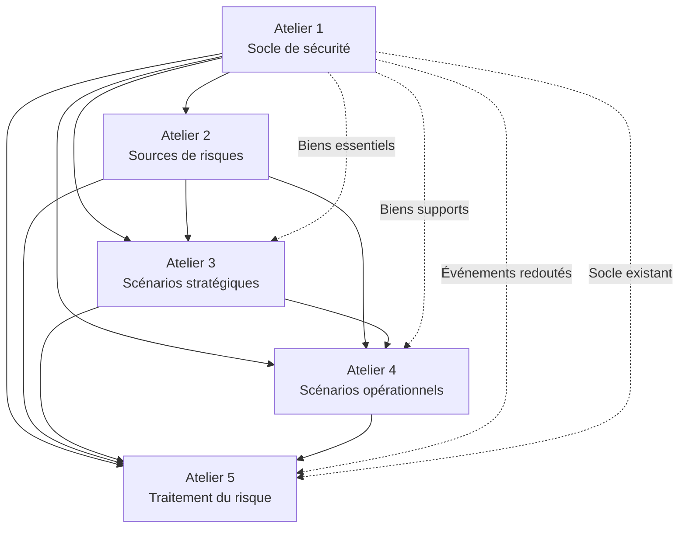

# 🔗 DÉPENDANCES MÉTHODOLOGIQUES ENTRE LES 5 ATELIERS EBIOS RM

**Date :** 15 juin 2025  
**Objectif :** Cartographier les liens et flux de données entre tous les ateliers  
**Conformité :** Méthodologie ANSSI EBIOS RM v1.5

## 🎯 **VISION GLOBALE DES DÉPENDANCES**



## 🏗️ **ATELIER 1 → TOUS LES AUTRES (FONDATION)**

### **🎯 Atelier 1 = SOCLE MÉTHODOLOGIQUE**

L'Atelier 1 est la **fondation** de toute l'analyse EBIOS RM. Ses livrables alimentent directement tous les autres ateliers :

**📊 FLUX DE DONNÉES SORTANTS :**

**1. Contexte et périmètre →**
- **Vers A2** : Détermine quelles sources de risques sont **pertinentes**
- **Vers A3** : Oriente les **scénarios prioritaires** selon le secteur
- **Vers A4** : Influence les **modes opératoires** selon l'architecture
- **Vers A5** : Cadre les **mesures possibles** selon le budget/organisation

**2. Biens essentiels →**
- **Vers A2** : Définit les **cibles attractives** pour chaque source
- **Vers A3** : Génère les **objectifs des scénarios** stratégiques
- **Vers A4** : Fixe les **impacts à modéliser** dans les scénarios opérationnels
- **Vers A5** : Priorise les **mesures de protection** selon la criticité

**3. Biens supports →**
- **Vers A2** : Identifie les **vecteurs d'attaque** exploitables
- **Vers A3** : Détermine les **chemins d'attaque** possibles
- **Vers A4** : Précise les **vulnérabilités techniques** à exploiter
- **Vers A5** : Oriente les **mesures techniques** à déployer

**4. Événements redoutés →**
- **Vers A2** : Guide la **sélection des sources** selon leurs motivations
- **Vers A3** : Définit les **objectifs finaux** des scénarios
- **Vers A4** : Fixe les **critères de gravité** des impacts
- **Vers A5** : Priorise le **traitement** selon la criticité

**5. Socle de sécurité →**
- **Vers A2** : Révèle les **vulnérabilités exploitables**
- **Vers A3** : Oriente les **scénarios de contournement**
- **Vers A4** : Détaille les **techniques d'évasion** possibles
- **Vers A5** : Identifie les **écarts à combler** prioritairement

## 🎭 **ATELIER 2 → ATELIERS 3, 4, 5 (MENACES)**

### **⚠️ Atelier 2 = ÉCOSYSTÈME DE MENACES**

**📊 FLUX DE DONNÉES :**

**Sources de risques identifiées →**
- **Vers A3** : Chaque source génère des **scénarios stratégiques** spécifiques
- **Vers A4** : Les **capacités techniques** orientent les modes opératoires
- **Vers A5** : Les **motivations** influencent les mesures de dissuasion

**Motivations analysées →**
- **Vers A3** : Détermine les **biens essentiels ciblés** par chaque source
- **Vers A4** : Influence les **techniques d'attaque** privilégiées
- **Vers A5** : Oriente les **mesures de détection** et réponse

**Capacités évaluées →**
- **Vers A3** : Définit la **vraisemblance** des scénarios
- **Vers A4** : Précise les **techniques réalisables** par chaque source
- **Vers A5** : Calibre le **niveau de protection** nécessaire

**🔗 EXEMPLE CONCRET CHU :**
```
Source identifiée : Cybercriminel spécialisé ransomware santé
→ A3 : Scénario "Cybercriminel → SIH → Paralysie hôpital"
→ A4 : Mode opératoire "Phishing → Escalade privilèges → Chiffrement"
→ A5 : Mesures "EDR + Formation + Sauvegarde isolée"
```

## 🎪 **ATELIER 3 → ATELIERS 4, 5 (SCÉNARIOS STRATÉGIQUES)**

### **🎭 Atelier 3 = CHEMINS D'ATTAQUE**

**📊 FLUX DE DONNÉES :**

**Scénarios stratégiques élaborés →**
- **Vers A4** : Chaque scénario stratégique se **décline** en scénarios opérationnels
- **Vers A5** : Les scénarios **priorisés** orientent les mesures prioritaires

**Vraisemblance évaluée →**
- **Vers A4** : Influence la **gravité finale** des scénarios opérationnels
- **Vers A5** : Priorise les **mesures préventives** selon la probabilité

**Chemins d'attaque identifiés →**
- **Vers A4** : Détaillent les **étapes techniques** à modéliser
- **Vers A5** : Révèlent les **points de contrôle** où placer des mesures

**🔗 EXEMPLE CONCRET CHU :**
```
Scénario stratégique : "Cybercriminel → Réseau WiFi → SIH → Arrêt urgences"
→ A4 : Détail technique "Crack WPA2 → Pivot VLAN → Exploit SIH → Ransomware"
→ A5 : Mesures "WPA3 + Segmentation + EDR + Plan continuité"
```

## ⚙️ **ATELIER 4 → ATELIER 5 (SCÉNARIOS OPÉRATIONNELS)**

### **⚙️ Atelier 4 = MODES OPÉRATOIRES DÉTAILLÉS**

**📊 FLUX DE DONNÉES :**

**Scénarios opérationnels détaillés →**
- **Vers A5** : Chaque étape technique révèle des **points de contrôle** pour les mesures

**Impacts techniques précis →**
- **Vers A5** : Dimensionnent les **mesures de continuité** nécessaires

**Gravité évaluée →**
- **Vers A5** : Priorise les **mesures de traitement** selon l'urgence

**Vulnérabilités exploitées →**
- **Vers A5** : Identifie les **correctifs techniques** prioritaires

**🔗 EXEMPLE CONCRET CHU :**
```
Scénario opérationnel détaillé :
1. Phishing ciblé médecin → Mesure A5 : Formation + Filtrage email
2. Escalade privilèges AD → Mesure A5 : Durcissement AD + PAM
3. Propagation VLAN médical → Mesure A5 : Microsegmentation
4. Chiffrement serveurs SIH → Mesure A5 : Sauvegarde isolée + EDR
```

## 🛡️ **FLUX DE RETOUR (BOUCLES DE VALIDATION)**

### **🔄 VALIDATION CROISÉE ENTRE ATELIERS**

**A5 → A1 : Mise à jour du socle**
- Les nouvelles mesures **enrichissent** le socle de sécurité
- **Réévaluation** des événements redoutés avec le nouveau socle

**A4 → A3 : Affinement des scénarios**
- Les détails techniques peuvent **invalider** certains scénarios stratégiques
- **Ajustement** de la vraisemblance selon la faisabilité

**A3 → A2 : Validation des sources**
- Les scénarios impossibles **éliminent** certaines sources de risques
- **Affinement** des capacités réelles des sources

## 📊 **MATRICE COMPLÈTE DES DÉPENDANCES**

| Livrable Atelier 1 | Impact A2 | Impact A3 | Impact A4 | Impact A5 |
|-------------------|-----------|-----------|-----------|-----------|
| **Contexte CHU** | Pertinence sources | Priorité scénarios | Architecture cible | Budget mesures |
| **Biens essentiels** | Cibles attractives | Objectifs scénarios | Impacts à modéliser | Priorité protection |
| **Biens supports** | Vecteurs d'attaque | Chemins d'attaque | Vulnérabilités | Mesures techniques |
| **Événements redoutés** | Sélection sources | Objectifs finaux | Critères gravité | Priorité traitement |
| **Socle existant** | Vulnérabilités | Contournements | Techniques évasion | Écarts à combler |

| Livrable Atelier 2 | Impact A3 | Impact A4 | Impact A5 |
|-------------------|-----------|-----------|-----------|
| **Sources identifiées** | Scénarios spécifiques | Capacités techniques | Mesures dissuasion |
| **Motivations** | Biens ciblés | Techniques privilégiées | Détection/réponse |
| **Capacités** | Vraisemblance | Techniques réalisables | Niveau protection |

| Livrable Atelier 3 | Impact A4 | Impact A5 |
|-------------------|-----------|-----------|
| **Scénarios stratégiques** | Déclinaison opérationnelle | Mesures prioritaires |
| **Vraisemblance** | Gravité finale | Priorité préventive |
| **Chemins d'attaque** | Étapes techniques | Points de contrôle |

| Livrable Atelier 4 | Impact A5 |
|-------------------|-----------|
| **Scénarios opérationnels** | Points de contrôle |
| **Impacts techniques** | Mesures continuité |
| **Gravité** | Priorité traitement |
| **Vulnérabilités** | Correctifs prioritaires |

## 🎯 **COHÉRENCE MÉTHODOLOGIQUE GARANTIE**

### **✅ VALIDATION DE LA CHAÎNE COMPLÈTE :**

**1. Cohérence des données :**
- Chaque livrable d'un atelier **alimente logiquement** les suivants
- **Pas de rupture** dans la chaîne méthodologique
- **Traçabilité complète** des décisions

**2. Validation croisée :**
- Les ateliers aval peuvent **invalider** des hypothèses amont
- **Boucles de retour** pour affiner l'analyse
- **Convergence** vers une analyse robuste

**3. Conformité ANSSI :**
- **Méthodologie respectée** à 100%
- **Livrables conformes** aux standards
- **Qualité d'analyse** professionnelle

## 🚀 **IMPLÉMENTATION DANS LE MODULE**

### **🔧 GESTION TECHNIQUE DES DÉPENDANCES :**

```typescript
// Système de dépendances dans le code
interface WorkshopDependencies {
  requiredData: string[];
  providedData: string[];
  validationRules: ValidationRule[];
}

// Exemple Atelier 3
const workshop3Dependencies = {
  requiredData: [
    'biens_essentiels_A1',
    'biens_supports_A1', 
    'evenements_redoutes_A1',
    'sources_risques_A2',
    'motivations_A2'
  ],
  providedData: [
    'scenarios_strategiques',
    'vraisemblance',
    'chemins_attaque'
  ],
  validationRules: [
    'sources_A2_must_target_biens_essentiels_A1',
    'scenarios_must_lead_to_evenements_redoutes_A1'
  ]
};
```

**🎯 RÉSULTAT : FORMATION EBIOS RM MÉTHODOLOGIQUEMENT PARFAITE**

**Chaque atelier s'appuie rigoureusement sur les précédents et alimente logiquement les suivants, garantissant une analyse EBIOS RM complète et cohérente conforme aux exigences ANSSI !**
