# EBIOS AI Manager - Complete System Flow Diagram

## 🏗️ System Architecture Overview

```mermaid
graph TB
    %% User Layer
    User[👤 Risk Manager/Auditor]
    
    %% Frontend Layer
    subgraph "Frontend Layer (Port 5173/80)"
        React[React 18 + TypeScript]
        Redux[Redux Toolkit Store]
        UI[Tailwind UI Components]
        Auth[Authentication Context]
        
        React --> Redux
        React --> UI
        React --> Auth
    end
    
    %% API Layer
    subgraph "API Backend (Port 3000)"
        Express[Express.js Server]
        AIProxy[AI Proxy Service]
        Routes[Route Handlers]
        Security[Security Middleware]
        
        Express --> AIProxy
        Express --> Routes
        Express --> Security
    end
    
    %% AI Service Layer
    subgraph "Python AI Service (Port 8081)"
        Flask[Flask Application]
        MLEngine[ML/NLP Engine]
        AgentSystem[Multi-Agent System]
        SemanticAnalysis[Semantic Analysis]
        
        Flask --> MLEngine
        Flask --> AgentSystem
        Flask --> SemanticAnalysis
    end
    
    %% Data Layer
    subgraph "Data Layer"
        Firebase[Firebase Firestore]
        PostgreSQL[PostgreSQL Database]
        Cache[Redis Cache]
        
        Firebase -.-> PostgreSQL
        PostgreSQL --> Cache
    end
    
    %% External Services
    subgraph "External Services"
        GeminiAI[Google Gemini AI]
        CloudRun[Google Cloud Run]
        Monitoring[Cloud Monitoring]
    end
    
    %% Connections
    User --> React
    React <--> Express
    Express <--> Flask
    Flask --> PostgreSQL
    Express --> Firebase
    Flask --> GeminiAI
    Flask --> Monitoring
    
    %% Deployment
    React -.-> CloudRun
    Express -.-> CloudRun
    Flask -.-> CloudRun
```



## 🔄 EBIOS RM Methodology Flow

```mermaid
graph TD
    %% Mission Creation
    Start([🚀 Start Mission]) --> CreateMission[Create New Mission]
    CreateMission --> DefineScope[Define Analysis Scope]
    
    %% Workshop 1 - Security Foundation
    DefineScope --> W1[📋 Workshop 1: Security Foundation]
    
    subgraph "Workshop 1 Flow"
        W1 --> BV[Define Business Values]
        BV --> DE[Identify Dreaded Events]
        DE --> EA[Map Essential Assets]
        EA --> SA[Map Supporting Assets]
        SA --> W1Complete{Workshop 1 Complete?}
    end
    
    %% Workshop 2 - Risk Sources
    W1Complete -->|Yes| W2[🎯 Workshop 2: Risk Sources]
    W1Complete -->|No| BV
    
    subgraph "Workshop 2 Flow"
        W2 --> RS[Identify Risk Sources]
        RS --> Exposure[Assess Exposure]
        Exposure --> Motivation[Evaluate Motivation]
        Motivation --> W2Complete{Workshop 2 Complete?}
    end
    
    %% Workshop 3 - Strategic Scenarios
    W2Complete -->|Yes| W3[⚡ Workshop 3: Strategic Scenarios]
    W2Complete -->|No| RS
    
    subgraph "Workshop 3 Flow"
        W3 --> AP[Create Attack Paths]
        AP --> RiskCalc[Calculate Risk Levels]
        RiskCalc --> RiskMatrix[Generate Risk Matrix]
        RiskMatrix --> W3Complete{Workshop 3 Complete?}
    end
    
    %% Workshop 4 - Operational Scenarios
    W3Complete -->|Yes| W4[🔍 Workshop 4: Operational Scenarios]
    W3Complete -->|No| AP
    
    subgraph "Workshop 4 Flow"
        W4 --> TechAttack[Detail Technical Attacks]
        TechAttack --> KillChain[Map Kill Chain]
        KillChain --> TechLikelihood[Assess Technical Likelihood]
        TechLikelihood --> W4Complete{Workshop 4 Complete?}
    end
    
    %% Workshop 5 - Risk Treatment
    W4Complete -->|Yes| W5[🛡️ Workshop 5: Risk Treatment]
    W4Complete -->|No| TechAttack
    
    subgraph "Workshop 5 Flow"
        W5 --> SM[Define Security Measures]
        SM --> Strategy[Choose Treatment Strategy]
        Strategy --> ResidualRisk[Calculate Residual Risk]
        ResidualRisk --> ActionPlan[Create Action Plan]
        ActionPlan --> W5Complete{Workshop 5 Complete?}
    end
    
    %% Final Steps
    W5Complete -->|Yes| Report[📊 Generate Final Report]
    W5Complete -->|No| SM
    Report --> Archive[📁 Archive Mission]
    Archive --> End([✅ Mission Complete])
```



## 🤖 AI Integration Flow

```mermaid
graph LR
    %% User Input
    UserInput[👤 User Input] --> ContextAnalysis[🧠 Context Analysis]
    
    %% AI Processing Pipeline
    subgraph "AI Processing Pipeline"
        ContextAnalysis --> AgentRouter[Agent Router]
        
        AgentRouter --> W1Agent[Workshop 1 Agent]
        AgentRouter --> W2Agent[Workshop 2 Agent]
        AgentRouter --> W3Agent[Workshop 3 Agent]
        AgentRouter --> W4Agent[Workshop 4 Agent]
        AgentRouter --> W5Agent[Workshop 5 Agent]
        
        W1Agent --> SemanticEngine[Semantic Analysis Engine]
        W2Agent --> SemanticEngine
        W3Agent --> SemanticEngine
        W4Agent --> SemanticEngine
        W5Agent --> SemanticEngine
        
        SemanticEngine --> MLSuggestions[ML Suggestion Engine]
        MLSuggestions --> QualityCheck[Data Quality Check]
        QualityCheck --> CoherenceValidation[Coherence Validation]
    end
    
    %% AI Output
    CoherenceValidation --> Suggestions[💡 AI Suggestions]
    CoherenceValidation --> AutoComplete[🔄 Auto-Completion]
    CoherenceValidation --> Validation[✅ Validation Feedback]
    
    %% Feedback Loop
    Suggestions --> UserFeedback[User Feedback]
    UserFeedback --> LearningLoop[Learning Loop]
    LearningLoop --> AgentRouter
```



## 📊 Data Flow Architecture

```mermaid
graph TD
    %% Frontend Data Flow
    subgraph "Frontend Data Layer"
        Components[React Components]
        ReduxStore[Redux Store]
        Selectors[Optimized Selectors]
        Actions[Action Creators]
        
        Components --> Selectors
        Selectors --> ReduxStore
        Components --> Actions
        Actions --> ReduxStore
    end
    
    %% API Data Flow
    subgraph "API Data Layer"
        Routes[Express Routes]
        Controllers[Route Controllers]
        Services[Business Services]
        Middleware[Security Middleware]
        
        Routes --> Middleware
        Middleware --> Controllers
        Controllers --> Services
    end
    
    %% Data Storage
    subgraph "Data Storage Layer"
        Firestore[Firebase Firestore]
        PostgresAI[PostgreSQL (AI Data)]
        RedisCache[Redis Cache]
        
        Firestore --> RedisCache
        PostgresAI --> RedisCache
    end
    
    %% AI Data Flow
    subgraph "AI Data Layer"
        AIModels[AI Models]
        VectorStore[Vector Embeddings]
        SemanticCache[Semantic Cache]
        
        AIModels --> VectorStore
        VectorStore --> SemanticCache
    end
    
    %% Connections
    ReduxStore <--> Services
    Services <--> Firestore
    Services <--> PostgresAI
    Services --> AIModels
    RedisCache --> Components
```

## 🔐 Security & Authentication Flow

```mermaid
graph TB
    %% User Authentication
    User[👤 User] --> LoginForm[🔐 Login Form]
    
    %% Development Mode
    LoginForm --> DevCheck{Development Mode?}
    DevCheck -->|Yes| DevAuth[Dev Auth Provider]
    DevAuth --> MockUser[Mock User Session]
    
    %% Production Mode
    DevCheck -->|No| FirebaseAuth[Firebase Authentication]
    FirebaseAuth --> TokenValidation[JWT Token Validation]
    TokenValidation --> UserSession[User Session]
    
    %% Authorization
    MockUser --> AuthContext[Auth Context]
    UserSession --> AuthContext
    AuthContext --> RoleCheck[Role-Based Access]
    
    %% API Security
    RoleCheck --> APICall[API Call]
    APICall --> RateLimit[Rate Limiting]
    RateLimit --> SecurityHeaders[Security Headers]
    SecurityHeaders --> RouteAccess[Route Access Control]
    
    %% Data Access
    RouteAccess --> DataAccess[Data Access Layer]
    DataAccess --> FirestoreRules[Firestore Security Rules]
    DataAccess --> DatabaseAuth[Database Authentication]
```



## 🚀 Deployment Flow

```mermaid
graph LR
    %% Development
    Developer[👨‍💻 Developer] --> LocalDev[Local Development]
    LocalDev --> DockerCompose[Docker Compose]
    
    %% Build Process
    Developer --> BuildProcess[Build Process]
    BuildProcess --> TypeScriptCompile[TypeScript Compilation]
    TypeScriptCompile --> ViteBuild[Vite Build]
    ViteBuild --> TestSuite[Test Suite]
    
    %% Deployment Options
    TestSuite --> DeploymentChoice{Deployment Target}
    
    %% Firebase Hosting
    DeploymentChoice -->|Firebase| FirebaseDeploy[Firebase Hosting]
    FirebaseDeploy --> FirebaseConfig[Firebase Configuration]
    FirebaseConfig --> ProductionFirebase[🌐 Production Firebase]
    
    %% Google Cloud Run
    DeploymentChoice -->|Cloud Run| CloudBuild[Cloud Build]
    CloudBuild --> ContainerRegistry[Container Registry]
    ContainerRegistry --> CloudRunDeploy[Cloud Run Deployment]
    CloudRunDeploy --> ProductionCloud[☁️ Production Cloud]
    
    %% Kubernetes
    DeploymentChoice -->|Kubernetes| K8sManifests[K8s Manifests]
    K8sManifests --> K8sCluster[Kubernetes Cluster]
    K8sCluster --> ProductionK8s[🚢 Production K8s]
```



## 🔄 Real-time Collaboration Flow


## 📈 Monitoring & Observability Flow


This comprehensive diagram system shows:
- **System Architecture**: Complete technical stack and service interactions
- **EBIOS RM Flow**: The 5-workshop methodology progression with decision points
- **AI Integration**: Multi-agent system and ML pipeline
- **Data Flow**: Frontend to backend data management
- **Security**: Authentication and authorization layers
- **Deployment**: Multiple deployment strategies
- **Real-time Collaboration**: User interaction sequences
- **Monitoring**: Observability and alerting systems

Each diagram can be rendered using Mermaid.js in documentation tools or IDEs that support it.