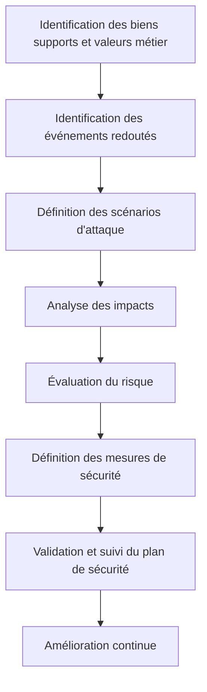
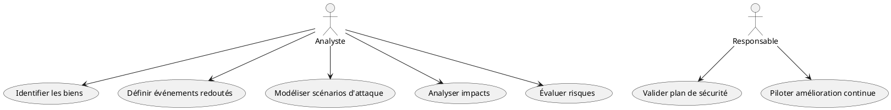

# Diagramme BPMN du processus métier : Gestion d'un scénario de risque EBIOS-RM

```mermaid
flowchart TD
    A[Identification des biens supports et valeurs métier] --> B[Identification des événements redoutés]
    B --> C[Définition des scénarios d'attaque]
    C --> D[Analyse des impacts]
    D --> E[Évaluation du risque]
    E --> F[Définition des mesures de sécurité]
    F --> G[Validation et suivi du plan de sécurité]
    G --> H[Amélioration continue]
```

---

# Diagramme UML (cas d'utilisation simplifié)

```plantuml
@startuml
actor Analyste
actor Responsable

Analyste --> (Identifier les biens)
Analyste --> (Définir événements redoutés)
Analyste --> (Modéliser scénarios d'attaque)
Analyste --> (Analyser impacts)
Analyste --> (Évaluer risques)
Responsable --> (Valider plan de sécurité)
Responsable --> (Piloter amélioration continue)
@enduml
```
