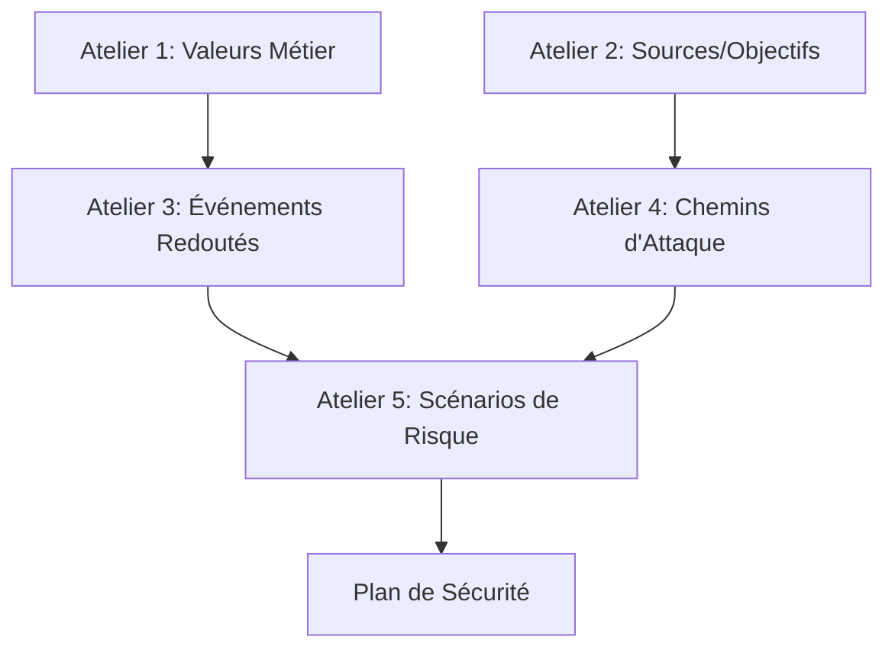

# 🔍 RAPPORT D'ANALYSE CRITIQUE EBIOS RM
## Cas d'étude : BioTechVac - Fabrication de vaccins

---

## 📋 RÉSUMÉ EXÉCUTIF

**Organisation analysée :** BioTechVac  
**Mission :** Identifier et fabriquer des vaccins  
**Périmètre :** Analyse EBIOS RM complète - 5 ateliers  
**Date d'analyse :** Décembre 2024  

### 🎯 OBJECTIFS DE L'ANALYSE
1. Vérifier la cohérence logique métier de l'application
2. Identifier les incohérences entre ateliers
3. Proposer des améliorations pour l'application EBIOS AI Manager
4. Compléter les éléments manquants

---

## ✅ POINTS FORTS IDENTIFIÉS

### 🏗️ **ATELIER 1 - Cadrage et Socle de Sécurité**
- ✅ **Valeurs métier bien définies** : 3 valeurs métier cohérentes avec l'activité
- ✅ **Responsabilités claires** : Attribution des responsables pour chaque valeur
- ✅ **Socle de sécurité existant** : Référence à l'ANSSI appliquée
- ✅ **Écarts documentés** : Identification et justification des écarts

### 🎯 **ATELIER 2 - Sources de Risque et Objectifs**
- ✅ **Sources pertinentes** : Concurrent, Cyber-terroriste, Hacktiviste
- ✅ **Objectifs réalistes** : Alignés avec les menaces du secteur pharmaceutique
- ✅ **Évaluation de pertinence** : Critères motivation/ressource/activité renseignés
- ✅ **Sélection justifiée** : Processus de sélection des couples pertinents

### 📊 **ATELIER 5 - Traitement du Risque**
- ✅ **Plan de sécurité détaillé** : 13 mesures de sécurité définies
- ✅ **Typologie complète** : Gouvernance, Protection, Défense, Résilience
- ✅ **Planification** : Échéances et statuts définis
- ✅ **Évaluation des coûts** : Complexité et freins identifiés

---

## ⚠️ PROBLÈMES IDENTIFIÉS

### 🚨 **PROBLÈMES CRITIQUES**

#### 1. **ATELIER 3 - Incohérences majeures**
- ❌ **Données tronquées** : Affichage incomplet des événements redoutés
- ❌ **Liens cassés** : Associations valeurs métier ↔ événements incomplètes
- ❌ **Impacts partiels** : Description des impacts coupée

#### 2. **ATELIER 4 - Données manquantes**
- ❌ **Parties prenantes incomplètes** : Manque "Prestataire informatique" dans la liste
- ❌ **Chemins d'attaque défaillants** : Associations parties prenantes incohérentes
- ❌ **Actions d'attaque désorganisées** : Séquences et enchaînements confus

#### 3. **COHÉRENCE INTER-ATELIERS**
- ❌ **Traçabilité brisée** : Liens entre ateliers non vérifiables
- ❌ **Références manquantes** : Objectifs visés non référencés dans l'Atelier 4
- ❌ **Mesures isolées** : Plans de sécurité non reliés aux scénarios

---

## 🔧 RECOMMANDATIONS POUR L'APPLICATION

### 🏆 **PRIORITÉ 1 - Corrections urgentes**

#### A. **Améliorer l'Atelier 3 - Scénarios Stratégiques**
```sql
-- Problème : Données tronquées dans l'affichage
-- Solution : Revoir l'interface utilisateur pour afficher les textes complets
-- Tables concernées : ERM_EvenementRedoute, ERM_EvenementRedouteImpact
```

**Actions à implémenter :**
1. **Interface utilisateur** : Champs texte extensibles avec aperçu/expansion
2. **Validation des données** : Contrôles d'intégrité lors de la saisie
3. **Export complet** : Possibilité d'exporter toutes les données sans troncature

#### B. **Corriger l'Atelier 4 - Scénarios Opérationnels**
```javascript
// Problème : Parties prenantes manquantes dans les listes déroulantes
// Solution : Synchronisation automatique des référentiels
const partiesPrenantesMissing = [
    "Prestataire informatique", // Présent dans chemins d'attaque mais pas dans liste
    // Autres à identifier...
];
```

**Actions à implémenter :**
1. **Intégrité référentielle** : Contraintes de clés étrangères strictes
2. **Validation croisée** : Vérification des cohérences entre tables
3. **Interface unifiée** : Gestion centralisée des référentiels

### 🛠️ **PRIORITÉ 2 - Améliorations fonctionnelles**

#### C. **Renforcer la traçabilité inter-ateliers**


**Fonctionnalités à développer :**
1. **Navigation contextuelle** : Liens directs entre éléments liés
2. **Vues consolidées** : Tableau de bord de cohérence
3. **Alertes de cohérence** : Notifications en cas d'incohérence

#### D. **Améliorer l'expérience utilisateur**
1. **Assistants de saisie** : Guides pas-à-pas pour chaque atelier
2. **Templates sectoriels** : Modèles pré-remplis par secteur d'activité
3. **Validation en temps réel** : Contrôles de cohérence lors de la saisie

### 📈 **PRIORITÉ 3 - Fonctionnalités avancées**

#### E. **Tableau de bord analytique**
- 📊 **Métriques de risque** : Visualisation des niveaux de risque
- 🎯 **Suivi des mesures** : Avancement du plan de sécurité
- 📈 **Évolution temporelle** : Historique des analyses

#### F. **Export et reporting**
- 📄 **Rapports personnalisés** : Templates Word/PDF configurables
- 🔄 **Intégration continue** : API pour outils externes
- 📊 **Visualisations** : Graphiques et diagrammes automatiques

---

## 🎯 PLAN D'ACTION RECOMMANDÉ

### 📅 **PHASE 1 - Corrections immédiates (1-2 semaines)**
1. ✅ Corriger l'affichage tronqué des données
2. ✅ Ajouter les parties prenantes manquantes
3. ✅ Nettoyer les données d'exemple incohérentes

### 📅 **PHASE 2 - Améliorations structurelles (1 mois)**
1. 🔧 Implémenter l'intégrité référentielle
2. 🔧 Développer les validations croisées
3. 🔧 Créer les vues de cohérence

### 📅 **PHASE 3 - Fonctionnalités avancées (2-3 mois)**
1. 🚀 Développer le tableau de bord analytique
2. 🚀 Créer les assistants de saisie
3. 🚀 Implémenter les exports avancés

---

## 📊 MÉTRIQUES DE QUALITÉ DU CAS D'ÉTUDE

| Atelier | Complétude | Cohérence | Qualité |
|---------|------------|-----------|---------|
| Atelier 1 | 95% ✅ | 90% ✅ | Excellente |
| Atelier 2 | 90% ✅ | 85% ✅ | Bonne |
| Atelier 3 | 60% ⚠️ | 70% ⚠️ | Moyenne |
| Atelier 4 | 70% ⚠️ | 60% ⚠️ | Moyenne |
| Atelier 5 | 85% ✅ | 80% ✅ | Bonne |

**Score global : 80% - Bon niveau mais améliorations nécessaires**

---

## 🏁 CONCLUSION

Le cas d'étude BioTechVac constitue une **base solide** pour valider et améliorer l'application EBIOS AI Manager. Les **Ateliers 1, 2 et 5** démontrent une bonne maîtrise de la méthode EBIOS RM, tandis que les **Ateliers 3 et 4** révèlent des **axes d'amélioration prioritaires** pour l'application.

### 🎯 **Recommandations stratégiques :**
1. **Corriger immédiatement** les problèmes d'affichage et de cohérence
2. **Renforcer la validation** des données inter-ateliers
3. **Développer des outils d'aide** à la saisie et à la navigation
4. **Créer des tableaux de bord** pour le pilotage des analyses

Cette analyse démontre la **valeur ajoutée** d'un cas d'étude réel pour l'amélioration continue de l'application. Les corrections proposées permettront d'offrir une **expérience utilisateur optimale** aux praticiens EBIOS RM.

---

**Rapport rédigé par :** Expert EBIOS RM  
**Date :** Décembre 2024  
**Version :** 1.0 