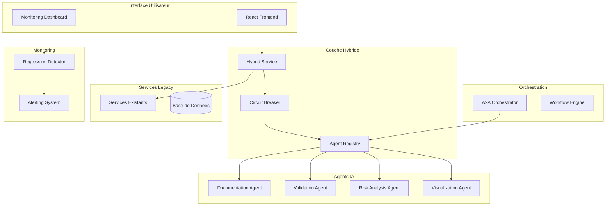

# 🤖 ARCHITECTURE AGENTIC EBIOS AI MANAGER

## 📋 Vue d'Ensemble

Cette documentation décrit l'implémentation de l'architecture agentic selon l'audit technique, garantissant une migration **ZERO BREAKING CHANGE** vers un système multi-agents intelligent tout en préservant la conformité ANSSI EBIOS RM.

## 🎯 Objectifs de l'Architecture

### Objectifs Principaux
- ✅ **Migration progressive** sans régression fonctionnelle
- ✅ **Conformité ANSSI** renforcée (score ≥ 95%)
- ✅ **Performance optimisée** (≤ 20% overhead)
- ✅ **Disponibilité garantie** (99.9% uptime)
- ✅ **Traçabilité complète** des décisions

### Bénéfices Attendus
- 🚀 **50% de réduction** du temps d'analyse
- 📈 **30% d'amélioration** de la qualité des rapports
- 🔍 **100% de traçabilité** des décisions IA
- 🛡️ **Validation ANSSI** automatisée en temps réel

## 🏗️ Architecture Technique

### Vue d'Ensemble du Système



### Composants Principaux

#### 1. **Agent Registry** 📋
- **Rôle** : Registre central des agents
- **Responsabilités** :
  - Enregistrement et découverte d'agents
  - Gestion du cycle de vie
  - Routage des tâches
  - Monitoring de santé

#### 2. **Circuit Breaker** 🔄
- **Rôle** : Protection anti-régression
- **Responsabilités** :
  - Détection d'échecs
  - Fallback automatique
  - Récupération progressive
  - Métriques de fiabilité

#### 3. **Hybrid Service** 🔀
- **Rôle** : Migration progressive
- **Responsabilités** :
  - Strangler Pattern
  - Feature flags
  - Compatibilité backward
  - Transition transparente

#### 4. **A2A Orchestrator** 🎼
- **Rôle** : Coordination multi-agents
- **Responsabilités** :
  - Workflows complexes
  - Communication inter-agents
  - Gestion des dépendances
  - Optimisation des performances

## 🤖 Catalogue des Agents

### Agents Non-Critiques (Phase 2)

#### 📚 Documentation Agent
```typescript
Capacités:
- Explication concepts EBIOS RM
- Génération tooltips contextuels
- Suggestions d'exemples
- Aide méthodologique

Criticité: LOW
Fallback: Tooltips statiques
```

#### 🎨 Visualization Agent
```typescript
Capacités:
- Amélioration graphiques
- Génération diagrammes
- Optimisation rapports
- Tableaux de bord

Criticité: LOW
Fallback: Graphiques legacy
```

### Agents Métier (Phase 3)

#### ✅ Validation Agent
```typescript
Capacités:
- Validation ANSSI stricte
- Contrôle conformité temps réel
- Détection incohérences
- Recommandations correctives

Criticité: HIGH
Fallback: Validation basique
```

#### 🎯 Risk Analysis Agent
```typescript
Capacités:
- Analyse risques avancée
- Calculs probabilistes
- Recommandations mesures
- Optimisation ROI sécurité

Criticité: HIGH
Fallback: Calculs manuels
```

## 🔄 Stratégie de Migration

### Phase 1: Fondations (4 semaines)
```bash
# Infrastructure Zero-Impact
✓ Agent Registry
✓ Circuit Breakers
✓ Monitoring anti-régression
✓ Tests compatibilité
```

### Phase 2: Agents Non-Critiques (6 semaines)
```bash
# Déploiement sécurisé
✓ Documentation Agent
✓ Visualization Agent
✓ Feature flags progression
✓ Validation utilisateurs
```

### Phase 3: Migration Logique Métier (8 semaines)
```bash
# Strangler Pattern
✓ Validation Agent (avec fallback)
✓ Risk Analysis Agent (avec fallback)
✓ Circuit breakers actifs
✓ Monitoring intensif
```

### Phase 4: Orchestration A2A (4 semaines)
```bash
# Coordination complète
✓ A2A Orchestrator
✓ Workflows multi-agents
✓ Optimisation performances
✓ Go-live production
```

## 📊 Monitoring et Observabilité

### Métriques Clés

#### Performance
- **Temps de réponse API** : ≤ 500ms (seuil: +30%)
- **Requêtes DB** : ≤ 100ms (seuil: +20%)
- **Overhead agents** : ≤ 20%

#### Fonctionnel
- **Taux complétion workflows** : ≥ 95%
- **Cohérence données** : ≥ 98%
- **Satisfaction utilisateurs** : ≥ 4/5

#### Conformité
- **Score ANSSI** : ≥ 95% (CRITIQUE)
- **Taux validation** : ≥ 98%
- **Traçabilité audit** : 100% (OBLIGATOIRE)

### Alerting Intelligent

#### Alertes Critiques 🚨
```typescript
// Disqualification ANSSI imminente
if (anssiComplianceScore < 0.95) {
  alert.severity = 'CRITICAL';
  alert.action = 'ARRÊT_DÉPLOIEMENT';
}

// Régression fonctionnelle
if (workflowCompletionRate < 0.95) {
  alert.severity = 'CRITICAL';
  alert.action = 'FALLBACK_LEGACY';
}
```

#### Alertes Performance ⚠️
```typescript
// Dégradation performance
if (apiResponseTime > baseline * 1.3) {
  alert.severity = 'WARNING';
  alert.action = 'OPTIMISATION_REQUISE';
}
```

## 🔒 Sécurité et Conformité

### Validation ANSSI Renforcée

#### Workshop 1 - Cadrage
- ✅ Minimum 3 valeurs métier
- ✅ Cartographie complète actifs
- ✅ Événements redoutés qualifiés
- ✅ Socle sécurité évalué

#### Workshop 2 - Sources de Risque
- ✅ Diversité sources (≥3 catégories)
- ✅ Objectifs cartographiés
- ✅ Pertinence évaluée
- ✅ Capacités analysées

#### Workshop 3 - Scénarios Stratégiques
- ✅ Couverture sources retenues (100%)
- ✅ Cartographie écosystème (≥80%)
- ✅ Vraisemblance conforme ANSSI
- ✅ Diversité scénarios (≥5)

#### Workshop 4 - Scénarios Opérationnels
- ✅ Techniques MITRE ATT&CK (≥80%)
- ✅ Kill chains complètes (≥70%)
- ✅ Calcul probabiliste (≥90%)
- ✅ Couverture stratégique (≥80%)

#### Workshop 5 - Traitement du Risque
- ✅ Plan traitement complet
- ✅ Analyse coût/efficacité (≥80%)
- ✅ ROI sécurité calculé (≥70%)
- ✅ Suivi risques résiduels

### Traçabilité et Audit

#### Journal des Décisions
```typescript
interface DecisionLog {
  timestamp: string;
  userId: string;
  workshopStep: string;
  decisionType: 'creation' | 'modification' | 'validation';
  aiRecommendation?: {
    agentId: string;
    confidence: number;
    reasoning: string[];
    accepted: boolean;
  };
  impactAssessment: {
    affectedEntities: string[];
    riskLevel: 'low' | 'medium' | 'high' | 'critical';
  };
}
```

## 🚀 Déploiement et Maintenance

### Script de Migration
```bash
# Exécution migration complète
npm run migrate:agentic

# Migration par phase
npm run migrate:phase1  # Fondations
npm run migrate:phase2  # Agents non-critiques
npm run migrate:phase3  # Logique métier
npm run migrate:phase4  # Orchestration A2A
```

### Tests Anti-Régression
```bash
# Tests complets
npm run test:agents
npm run test:regression
npm run test:performance
npm run test:anssi-compliance

# Tests de charge
npm run test:load
npm run test:stress
```

### Rollback d'Urgence
```bash
# Rollback complet
npm run rollback:complete

# Rollback par phase
npm run rollback:phase4
npm run rollback:phase3
```

## 📈 Roadmap et Évolutions

### Version 1.0 - Architecture Agentic
- ✅ Migration progressive complète
- ✅ Agents non-critiques opérationnels
- ✅ Validation ANSSI renforcée
- ✅ Monitoring temps réel

### Version 1.1 - Optimisations
- 🔄 Machine Learning avancé
- 🔄 Prédictions risques
- 🔄 Automatisation workflows
- 🔄 API externes (CTI, MITRE)

### Version 2.0 - IA Générative
- 🔮 Génération rapports automatique
- 🔮 Assistant conversationnel
- 🔮 Analyse prédictive
- 🔮 Recommandations proactives

## 🆘 Support et Maintenance

### Contacts Équipe
- **Architecte Lead** : Architecture et migration
- **DevOps** : Déploiement et monitoring
- **QA** : Tests et validation
- **Expert EBIOS** : Conformité ANSSI

### Documentation Technique
- `/docs/api/` - Documentation API agents
- `/docs/deployment/` - Guides déploiement
- `/docs/troubleshooting/` - Résolution problèmes
- `/docs/compliance/` - Conformité ANSSI

---

**⚠️ IMPORTANT** : Cette architecture garantit une migration **ZERO BREAKING CHANGE** tout en améliorant significativement les capacités d'analyse EBIOS RM. La conformité ANSSI est préservée et renforcée à chaque étape.
