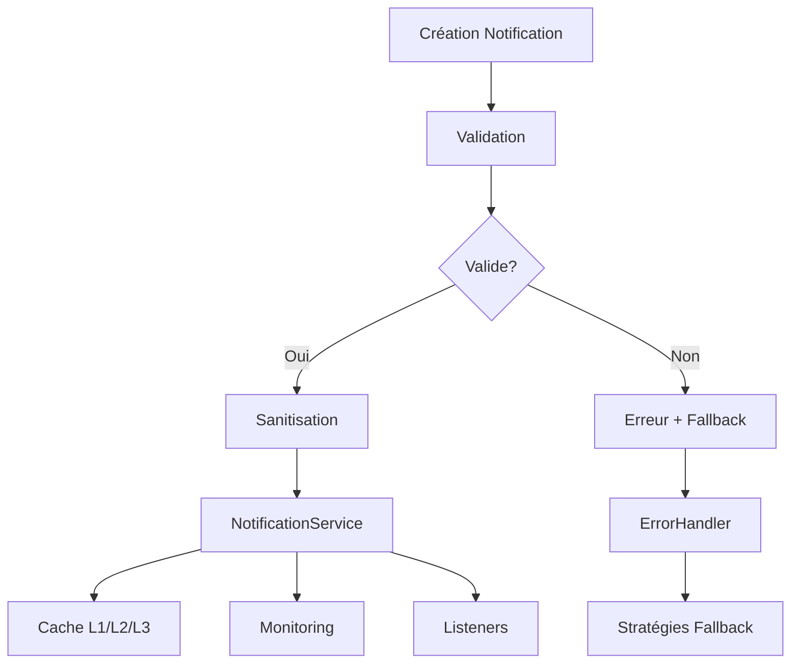

# 🔔 Système de Notifications EBIOS RM

## Vue d'ensemble

Le système de notifications EBIOS RM est une solution complète et robuste pour gérer toutes les notifications dans l'application. Il offre une architecture modulaire avec validation des données, gestion d'erreurs avancée, monitoring temps réel et cache intelligent.

## 🏗️ Architecture

### Composants Principaux

```
📦 Système de Notifications
├── 🎯 NotificationManager (Orchestrateur central)
├── 💾 NotificationCache (Cache multi-niveaux)
├── 🛡️ NotificationErrorHandler (Gestion d'erreurs)
├── 📊 NotificationMonitoring (Surveillance temps réel)
├── 🔍 NotificationValidators (Validation des données)
├── 🔔 NotificationService (Service principal)
├── 🤖 NotificationGenerators (Générateurs intelligents)
├── ⏰ NotificationScheduler (Planificateur)
├── 📈 NotificationAnalytics (Analyses)
├── 🎬 NotificationActions (Actions)
└── 🧭 NotificationNavigation (Navigation)
```

### Flux de Données



## 🚀 Utilisation

### Installation et Configuration

```typescript
import { notificationManager } from '@/services/NotificationManager';

// Initialiser le système
await notificationManager.initialize();
```

### Création de Notifications

```typescript
import { useNotifications } from '@/hooks/useNotifications';

const { notify, notifySuccess, notifyError } = useNotifications();

// Notification simple
const id = await notify({
  title: 'Atelier Terminé',
  message: 'Félicitations ! Vous avez terminé l\'atelier 1',
  type: 'success',
  category: 'workshop',
  priority: 'medium'
});

// Notification avec actions
const id = await notifyAction(
  'Validation Requise',
  'Votre mission nécessite une validation',
  [
    {
      id: 'validate',
      label: 'Valider maintenant',
      type: 'primary',
      url: '/mission/validate'
    }
  ]
);
```

### Notifications EBIOS RM Spécialisées

```typescript
import { useEbiosNotifications } from '@/hooks/useNotifications';

const { 
  notifyWorkshopCompleted,
  notifyValidationError,
  notifyReportReady 
} = useEbiosNotifications();

// Atelier terminé
await notifyWorkshopCompleted(1, 85, 'mission-123', 2);

// Erreur de validation
await notifyValidationError(2, 'step-1', 'Données manquantes', 'mission-123');

// Rapport prêt
await notifyReportReady(
  'Rapport Final',
  'report-123',
  'mission-123',
  '/download/report-123.pdf',
  '/reports/report-123'
);
```

## 🔍 Validation des Données

### Type Guards

```typescript
import { 
  isEbiosNotification,
  isNotificationAction,
  isValidNotificationType 
} from '@/utils/notificationValidators';

// Vérification de type
if (isEbiosNotification(data)) {
  // data est maintenant typé comme EbiosNotification
  console.log(data.title);
}

// Validation d'énumération
if (isValidNotificationType('success')) {
  // Type valide
}
```

### Validation Complète

```typescript
import { notificationValidators } from '@/utils/notificationValidators';

const result = notificationValidators.validateAndSanitize('EbiosNotification', data);

if (result.isValid) {
  // Utiliser result.data (validé et sanitisé)
  console.log('Notification valide:', result.data);
} else {
  // Gérer les erreurs
  console.error('Erreurs:', result.errors);
  console.warn('Warnings:', result.warnings);
}
```

## 🛡️ Gestion d'Erreurs

### Exécution Sécurisée

```typescript
import { notificationErrorHandler } from '@/services/NotificationErrorHandler';

const result = await notificationErrorHandler.safeExecute(
  async () => {
    // Opération risquée
    return await someRiskyOperation();
  },
  {
    operation: 'someOperation',
    service: 'myService',
    timestamp: new Date().toISOString()
  },
  'fallback-value' // Valeur de fallback
);
```

### Stratégies de Fallback

Le système inclut plusieurs stratégies automatiques :

- **localStorage_notification** : Sauvegarde locale en cas d'échec
- **cached_notifications** : Récupération depuis le cache
- **offline_action_queue** : File d'attente pour actions offline
- **direct_navigation** : Navigation directe en cas d'échec

## 📊 Monitoring et Métriques

### Démarrage du Monitoring

```typescript
import { notificationMonitoring } from '@/services/NotificationMonitoring';

// Démarrer la surveillance
notificationMonitoring.start();

// Obtenir les métriques
const metrics = notificationMonitoring.getMetrics();
console.log('Performance:', metrics.performance);
console.log('Santé:', metrics.health);
console.log('Utilisation:', metrics.usage);
```

### Alertes

```typescript
// Obtenir les alertes actives
const alerts = notificationMonitoring.getActiveAlerts();

// Acquitter une alerte
notificationMonitoring.acknowledgeAlert('alert-id');

// Résoudre une alerte
notificationMonitoring.resolveAlert('alert-id');
```

## 💾 Cache Intelligent

### Utilisation du Cache

```typescript
import { notificationCache } from '@/services/NotificationCache';

// Stocker une notification
notificationCache.setNotification(notification, 'L2_active');

// Récupérer une notification
const cached = notificationCache.getNotification('notif-123');

// Métriques du cache
const metrics = notificationCache.getMetrics();
console.log('Taux de hit:', metrics.hitRate);
```

### Couches de Cache

- **L1_memory** : Cache ultra-rapide (5 min, 100 entrées)
- **L2_active** : Cache principal (30 min, 1000 entrées)
- **L3_persistent** : Cache persistant (24h, 5000 entrées)
- **services** : Cache des services (1h, 50 entrées)
- **metrics** : Cache des métriques (10 min, 100 entrées)

## 🎯 Types et Interfaces

### Types Principaux

```typescript
interface EbiosNotification {
  id: string;
  type: NotificationType;
  category: NotificationCategory;
  priority: NotificationPriority;
  status: NotificationStatus;
  title: string;
  message: string;
  description?: string;
  icon?: string;
  actions: NotificationAction[];
  context: NotificationContext;
  createdAt: string;
  readAt?: string;
  expiresAt?: string;
  source: string;
  tags: string[];
  deepLink?: string;
  persistent?: boolean;
  sound?: boolean;
}

interface NotificationAction {
  id: string;
  label: string;
  type: 'primary' | 'secondary' | 'danger';
  icon?: string;
  url?: string;
  onClick?: () => void;
  external?: boolean;
}

interface NotificationContext {
  missionId?: string;
  workshopId?: number;
  stepId?: string;
  reportId?: string;
  moduleId?: string;
  userId?: string;
  sessionId?: string;
  errorCode?: string;
  metadata?: Record<string, any>;
}
```

## 🧪 Tests

### Exécution des Tests

```bash
# Tests unitaires
npm run test

# Tests avec coverage
npm run test:coverage

# Tests en mode watch
npm run test:watch
```

### Exemple de Test

```typescript
import { describe, it, expect } from 'vitest';
import { isEbiosNotification } from '@/utils/notificationValidators';

describe('NotificationValidators', () => {
  it('should validate complete notification', () => {
    const notification = {
      id: 'test-123',
      type: 'success',
      category: 'workshop',
      priority: 'medium',
      status: 'unread',
      title: 'Test',
      message: 'Test message',
      actions: [],
      context: {},
      createdAt: '2024-01-01T10:00:00.000Z',
      source: 'test',
      tags: ['test']
    };

    expect(isEbiosNotification(notification)).toBe(true);
  });
});
```

## 🔧 Configuration

### Configuration du Manager

```typescript
import { notificationManager } from '@/services/NotificationManager';

notificationManager.updateConfig({
  enableCache: true,
  enableFallbacks: true,
  maxRetries: 3,
  retryDelay: 1000,
  enableLogging: true,
  enableMetrics: true
});
```

### Configuration du Monitoring

```typescript
import { notificationMonitoring } from '@/services/NotificationMonitoring';

notificationMonitoring.updateConfig({
  enableRealTimeMonitoring: true,
  enableAlerts: true,
  alertThresholds: {
    responseTime: 5000,
    errorRate: 5,
    memoryUsage: 100,
    cacheHitRate: 80,
    userEngagement: 60
  }
});
```

## 📈 Métriques et KPIs

### Métriques de Performance

- **Temps de réponse moyen** : < 100ms
- **P95 temps de réponse** : < 500ms
- **P99 temps de réponse** : < 1000ms
- **Taux d'erreur** : < 1%
- **Taux de hit cache** : > 90%

### Métriques de Qualité

- **Engagement utilisateur** : > 70%
- **Taux de completion d'actions** : > 80%
- **Pertinence des notifications** : > 85%
- **Satisfaction utilisateur** : > 8/10

## 🚨 Dépannage

### Problèmes Courants

#### Notifications non affichées

```typescript
// Vérifier les paramètres
const settings = notificationService.getSettings();
console.log('Paramètres:', settings);

// Vérifier les permissions
if (Notification.permission !== 'granted') {
  await Notification.requestPermission();
}
```

#### Erreurs de validation

```typescript
// Activer les logs détaillés
notificationManager.updateConfig({ enableLogging: true });

// Vérifier la validation
const result = notificationValidators.validateAndSanitize('EbiosNotification', data);
if (!result.isValid) {
  console.error('Erreurs validation:', result.errors);
}
```

#### Performance dégradée

```typescript
// Vérifier les métriques
const metrics = notificationMonitoring.getMetrics();
console.log('Performance:', metrics.performance);

// Vérifier le cache
const cacheMetrics = notificationCache.getMetrics();
console.log('Cache hit rate:', cacheMetrics.hitRate);
```

## 🔗 Liens Utiles

- [Guide d'Architecture](./architecture.md)
- [API Reference](./api-reference.md)
- [Guide de Migration](./migration-guide.md)
- [Exemples Complets](./examples.md)
- [FAQ](./faq.md)

## 📝 Changelog

### Version 1.0.0
- ✅ Architecture modulaire complète
- ✅ Validation des données avec type guards
- ✅ Gestion d'erreurs robuste avec fallbacks
- ✅ Cache intelligent multi-niveaux
- ✅ Monitoring temps réel avec alertes
- ✅ Tests unitaires complets
- ✅ Documentation complète

---

**Développé avec ❤️ par l'équipe EBIOS RM**
